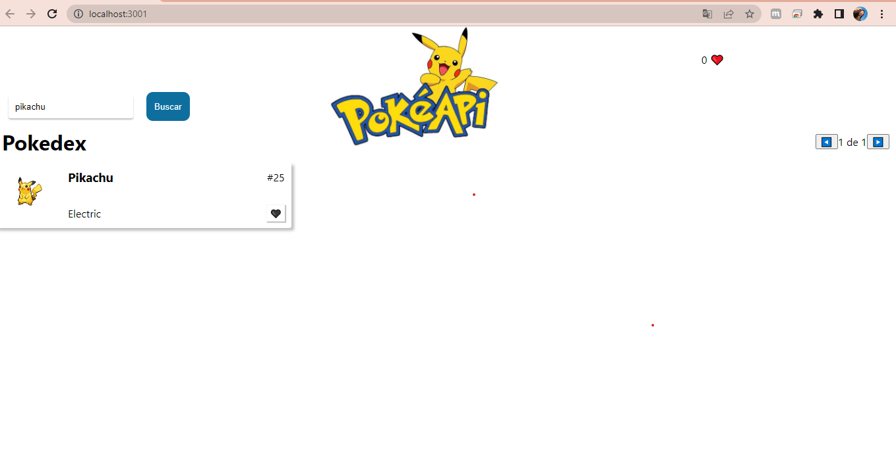
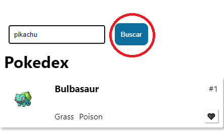
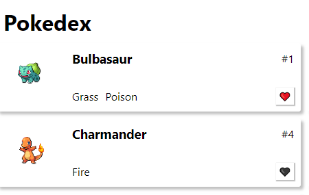
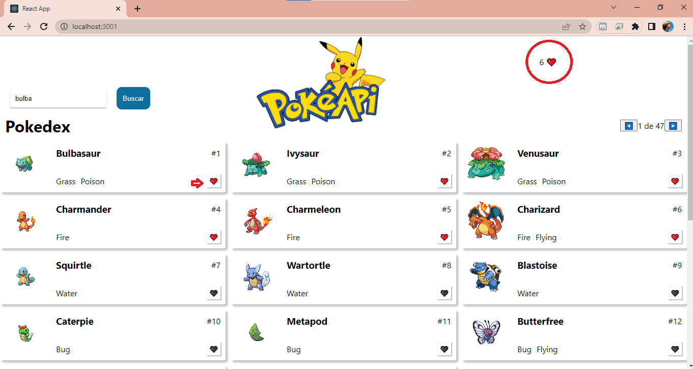

<h1 align="center">

</h1>
<h1 align="center">Projeto Pokemon Joy</h1>

<h2 align="center">Site: Personagens pokemon </h2>

---
<h3 align="center">
<a href=""> acessar demonstração do site</a>
</h3>

---

## Índice
- [Sobre](#-sobre)
- [Tecnologias utilizadas](#-tecnologias-utilizadas)
- [Como Baixar o projetos](#-como-baixar-o-projeto)
- [Funcionalidades do projeto](#-funcionalidades-do-projeto)
---

## 📃 Sobre

### Este projeto tem como finalidade o desenvolvimento prático e a apresentação de um site de personagens de pokemon para conclusão do curso de Web fullStack da instituição de ensino Labenu.
 

---

## 💻 Tecnologias utilizadas

### O projeto foi desenvolvido com as seguintes tecnologias:

* Css 
* Javascript
* React.js
* Hooks (UseStates e UseEffect)
* LocalStorage
* useContext
---

## 📂 Como baixar o projeto

bash
# clonar repositório
$ git clone (link do repo)

# Entrar no diretório
$ cd Nata-Mendes

# Entrar nas dependências
$ cd modulo-atual/projeto-pokedex

# Entrar nas dependências
$ cd pokedex

# Abrir o terminal Vs code 
$ code .

# Instalar as depedências
$ npm install

#Iniciar o projeto
$ npm run start

---

## 🔗 Funcionalidades do Projeto

### Passo a passo:
 

- *Barra de pesquisa*:

É um input ligado aos personagens, que possibilita o usuário procurar por seus nomes e ao apertar o botão rederiza apenas o personagem digitado.

---

- *Botão pesquisar:*

Uma tag "button" ligado ao input e aos personagens que possibilita ao usuário causar ação no texto digitado no input. 

---

- *Personagens:*

Os personagens foram puxados da Api "PokeApi" e renderizados na tela com suas carecteristicas. 

---

*Botão like:*

É uma tag "buttom" com a funcionalidade Onclick que ao usuário clicar no botão a imagem se alterna entre coração preenchido que conta um like no contador e coração vazio retira a marcação do usuário. 

* Contador de like:*

Ao usuário apertar o coração/botãolike ele contabiliza quantos personagens o usuário marcou, destacando - os.  

## Apresentação  aluna da turma Joy 

# <h3 align="center">Desenvolvido por *Natã de Lima Mendes*  </h3>