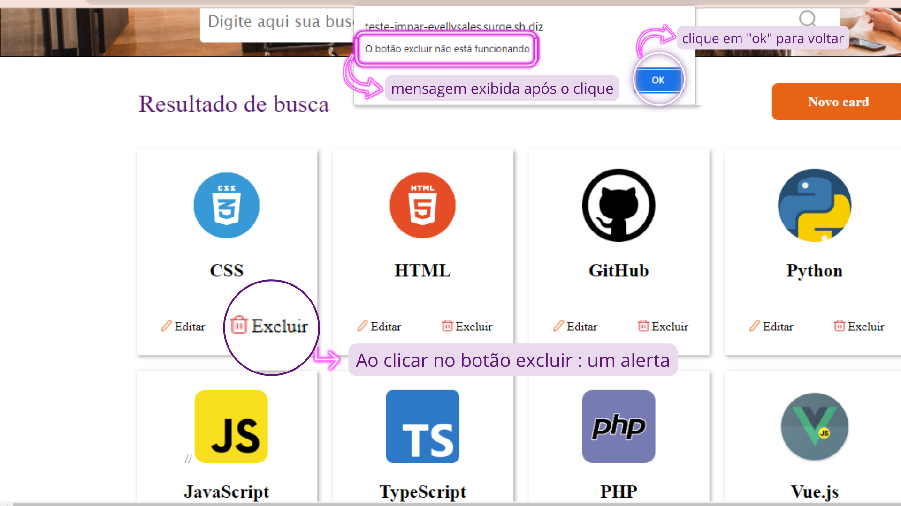
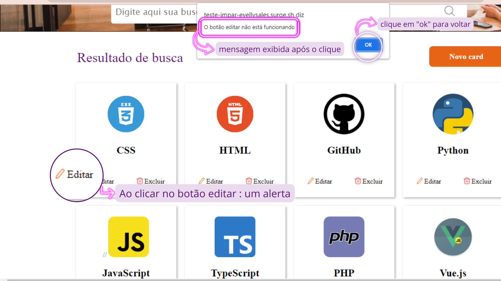
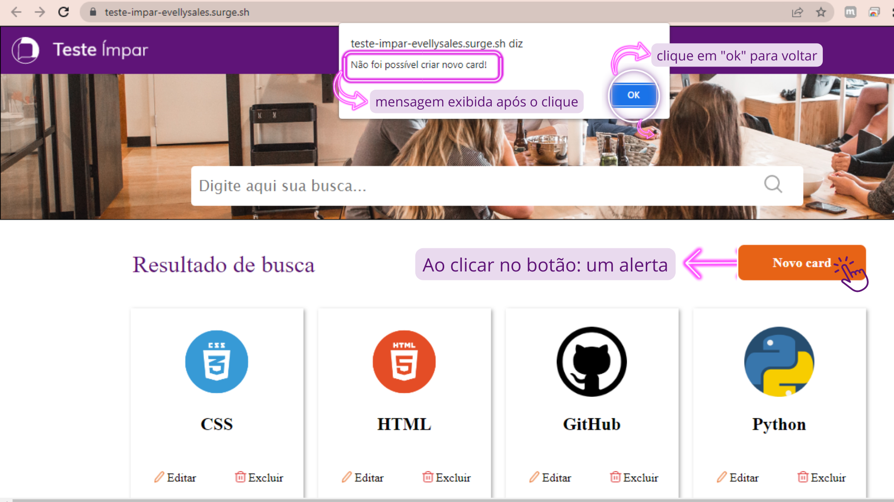

<h1 align="center">

</h1>

<h1 align="center">Projeto Teste ímpar</h1>

<h2 align="center">Site: Cards de programação</h2>

---
<h3 align="center">
<a href="https://teste-impar-evellysales.surge.sh/"> acessar demonstração do site</a>
</h3>

---

## Índice
- [Sobre](#-sobre)
- [Tecnologias utilizadas](#-tecnologias-utilizadas)
- [Como Baixar o projetos](#-como-baixar-o-projeto)
- [Funcionalidades do projeto](#-funcionalidades-do-projeto)
---

## 📃 Sobre

### Este projeto tem como finalidade o desenvolvimento prático e a apresentação de um site de cards para avaliação no **processo seletivo da empresa ímpar**  que dispõe a vaga de Front-end Jr.
<br>

---

## 💻 Tecnologias utilizadas

### O projeto foi desenvolvido com as seguintes tecnologias:

* React.js
* Styled-Components
* Hooks (UseStates e UseEffect)

---

## 📂 Como baixar o projeto

```bash
# clonar repositório
$ git clone https://github.com/EvellySales/teste-impar.git

# Entrar no diretório
$ cd teste-impar

# Entrar nas dependências
$ cd projeto-impar

# Abrir o terminal Vs code 
$ code .

# Instalar as depedências
$ npm install

#Iniciar o projeto
$ npm run start
```

---

## 🔗 Funcionalidades do Projeto


### Conjunto de cards de programação 
<br>

- **Botão excluir**:

É uma tag "p" com a funcionalidade Onclick que ao usuário clicar na palavra excluir dos cards renderiza uma mensagem para o usuário que "não foi possível excluir" .



---

- **Botão editar:**

É uma tag "p" com a funcionalidade Onclick que ao usuário clicar na palavra editar dos cards renderiza uma mensagem para o usuário que "não foi possível editar" 


---

- **Botão Novo Card:**

É uma tag "buttom" com a funcionalidade Onclick que ao usuário clicar na palavra "Novo Card" renderiza uma mensagem para o usuário que "Não foi possível criar novo card!" 



---

## 📢 Observação: em construção 🚧
-  Botão lupa e input pesquisar 
- Separar estilização no componente styled.

# <h3 align="center">Desenvolvido por **Evelly Sales**  </h3>